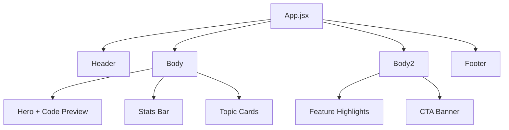

<div align="center">

# DSA Revision Website — Landing Page

**A modern, responsive landing page for a DSA revision platform** — built with React, Vite, and Tailwind CSS to help learners revise Data Structures & Algorithms through structured notes, curated problems, and topic-wise navigation.

[](https://react.dev/)
[](https://vitejs.dev/)
[](https://tailwindcss.com/)
[](https://eslint.org/)
[](#license)
[](https://github.com/smitrabari/DSA-Revision-Website-Landing-Page/stargazers)

</div>

---

## Preview

> Add a screenshot or GIF of the landing page here — it's the first thing visitors see.
>
> ```md
> 
> ```
>
> Tip: run `npm run dev`, take a screenshot of the hero + topic cards section, save it to `src/assets/preview.png`, and swap the line above in.

---

## Features

- **Hero Section** — Intro with a live code preview panel (Two Sum example) and a topic sidebar
- **Stats Bar** — Highlights key numbers (problems solved, revision notes, core topics, learners)
- **Topic Cards** — Quick-access cards for Arrays, Linked List, Stack, Queue, Trees, Graphs, Sorting, and Dynamic Programming
- **Feature Highlights** — Revision Notes, Visual Explanations, Curated Problems, and Progress Tracking
- **Call-to-Action Banner** — Encourages users to start revising for interviews
- **Responsive Navbar & Footer** — Includes navigation links, social icons (GitHub, LinkedIn, X/Twitter), and site info
- Fully responsive layout (mobile, tablet, desktop) using Tailwind CSS utility classes
- Icon-driven UI using `react-icons` and `lucide-react`


## Component Flow



## Project Structure

```
DSA-Revision-Website-Landing-Page/
├── public/
│   └── Favicon.png
├── src/
│   ├── assets/
│   │   ├── Footer.png
│   │   └── logo.png
│   ├── Components/
│   │   ├── Header.jsx      # Navbar with logo, nav links, login/CTA
│   │   ├── Body.jsx        # Hero section + stats + topic cards
│   │   ├── Body2.jsx       # Feature highlights + CTA banner
│   │   └── Footer.jsx      # Footer with links and socials
│   ├── App.jsx             # Root component composing all sections
│   ├── main.jsx            # App entry point
│   ├── App.css
│   └── index.css
├── index.html
├── package.json
├── vite.config.js
└── eslint.config.js
```

## Getting Started

### Prerequisites
- [Node.js](https://nodejs.org/) (v18 or higher recommended)
- npm (comes with Node.js)

### Installation

```bash
# Clone the repository
git clone https://github.com/smitrabari/DSA-Revision-Website-Landing-Page.git

# Move into the project directory
cd DSA-Revision-Website-Landing-Page

# Install dependencies
npm install
```

### Running Locally

```bash
npm run dev
```

The app will be available at `http://localhost:5173` (default Vite port).

### Available Scripts

| Command           | Description                              |
|-------------------|-------------------------------------------|
| `npm run dev`     | Starts the development server with HMR    |
| `npm run build`   | Builds the app for production             |
| `npm run preview` | Previews the production build locally     |
| `npm run lint`    | Runs ESLint to check code quality         |

## Roadmap

- [ ] Wire up navbar links (Topic, Roadmap, Problem, Cheatsheets, About) to real pages
- [ ] Add authentication (Login / Get Started flow)
- [ ] Connect topic cards to individual revision pages
- [ ] Add dark mode support
- [ ] Make the mobile hamburger menu functional

## Contributing

[](http://makeapullrequest.com)

Contributions, issues, and feature requests are welcome.

1. Fork the project
2. Create your feature branch (`git checkout -b feature/amazing-feature`)
3. Commit your changes (`git commit -m 'Add some amazing feature'`)
4. Push to the branch (`git push origin feature/amazing-feature`)
5. Open a Pull Request

## License

This project currently has no license specified. Consider adding one (e.g., MIT) if you plan to open it up for contributions.

## Author

<div align="center">

**Smit Rabari**

[](https://github.com/smitrabari)

### If you find this project useful, consider giving it a star.

</div>
